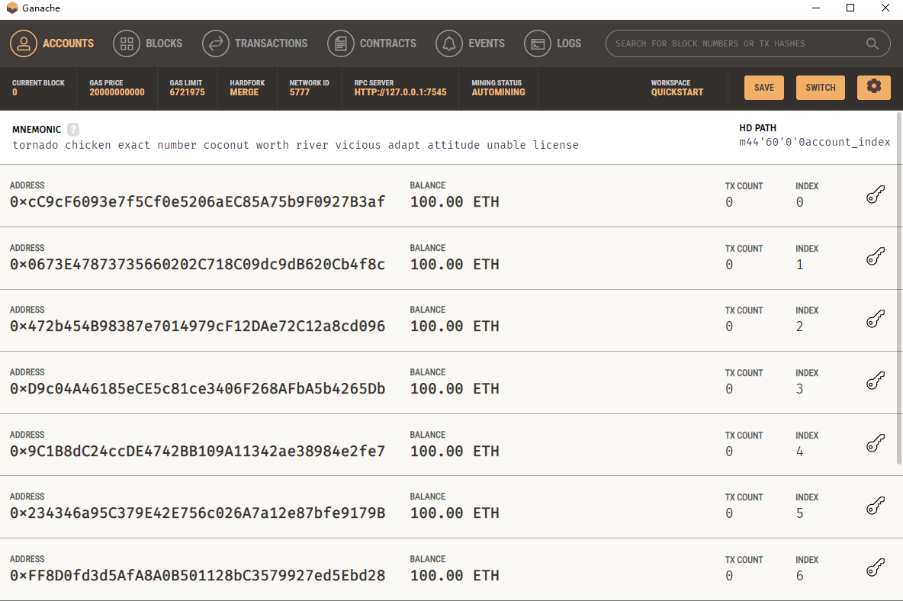
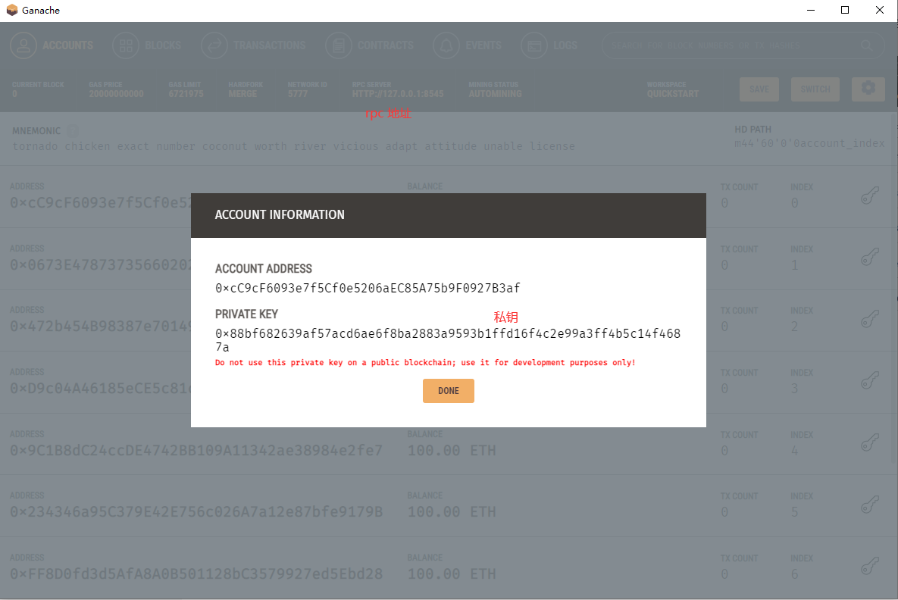
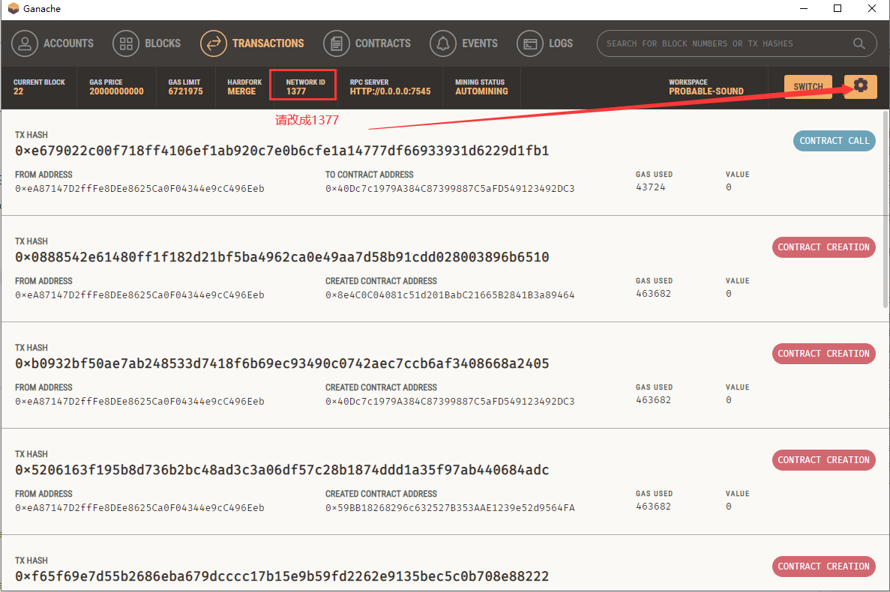
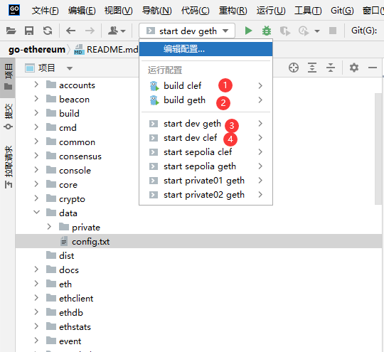

# 安装solc

```shell
yarn add solc
```

# 编译sol

```shell
# yarn compile solcjs --bin --abi --include-path node_modules/ --base-path . -o . SimpleStorage.sol
yarn compile
```

# 测试网络环境ganache
你需要先下载他: [https://archive.trufflesuite.com/ganache/](https://archive.trufflesuite.com/ganache/)

注意: 已经不再更新, 之后会使用hardhat, 并且ganache的networkid(chainid)是有bug的, 默认的5777不生效, 而是1377生效





# 安装ethers
用于连接测试网络和钱包
```shell
yarn add ethers
```

# 安装fs-extra
用于要读取编译完成的abi文件和bytecode二进制文件
```shell
yarn add fs-extra
```

# 安装dotenv
用于读取.env文件的环境变量
```shell
yarn add dotenv
```

# 部署sol合约

```shell
cd 6.\ 一个Ethers.js的简单存储/
node deploy.js
```

如果你不想把私钥存储在env中, 可以直接用命令设置
```shell
PRIVATE_KEY=0x1234567890 node deploy.js
```

但是这样了你觉得还不安全, 那么还有另一种方式

# 加密私钥
`encryptkey.js`: 加密私钥的脚本
```shell
# 生成加密私钥文件 .encryptedKey.json
node encryptkey.js
```

替换deploy.js中的PRIVATE_KEY为加密后的私钥
```js

    // let provider = new ethers.JsonRpcProvider(process.env.RPC_URL)
    // let wallet = new ethers.Wallet(process.env.PRIVATE_KEY, provider)

    // 使用加密过的私钥连接上一个钱包
    let provider = new ethers.JsonRpcProvider(process.env.RPC_URL)
    const encryptedJson = fs.readFileSync("./.encryptedKey.json", "utf8");
    let wallet = ethers.Wallet.fromEncryptedJsonSync(
        encryptedJson,
        process.env.PRIVATE_KEY_PASSWORD
    );
    wallet = wallet.connect(provider);

```

此时, 你将不再需要 `PRIVATE_KEY` 的环境变量, 因为生成的[密钥文件](.encryptedKey.json)就是私钥, 但是需要配合`PRIVATE_KEY_PASSWORD`密码才能使用

# 使用geth测试网络


获取客户端[https://github.com/luode0320/go-ethereum.git](https://github.com/luode0320/go-ethereum.git)

依次启动配置:
1. 编译 clef 创建账户
2. 编译 geth 客户端
3. 启动 geth dev 客户端
4. 创建一个账户





在 dev 的控制台依次执行下面的脚本, 转账eth给我们创建的账户
```shell
# 查看所有账户
eth.accounts
# 给我们创建的转换转账
eth.sendTransaction({from: eth.accounts[0], to: eth.accounts[1], value: 100000000000000000000})
# 查看我们的转换的余额
eth.getBalance(eth.accounts[1])
```

将 `start dev clef` 生成的加密密钥拷贝指项目中[.gethencryptedKey.json](.gethencryptedKey.json)

# 修改 deploy.js 

```js
    // let provider = new ethers.JsonRpcProvider(process.env.RPC_URL)
    // let wallet = new ethers.Wallet(process.env.PRIVATE_KEY, provider)

    // 使用加密过的私钥连接上一个钱包
    //let provider = new ethers.JsonRpcProvider(process.env.RPC_URL)
    // const encryptedJson = fs.readFileSync("./.encryptedKey.json", "utf8");
    // let wallet = ethers.Wallet.fromEncryptedJsonSync(
    //     encryptedJson,
    //     process.env.PRIVATE_KEY_PASSWORD
    // );
    // wallet = wallet.connect(provider);


    // 使用geth加密过的私钥连接上一个钱包
    let provider = new ethers.JsonRpcProvider(process.env.GETH_RPC_URL)
    const encryptedJson = fs.readFileSync("./.gethencryptedKey.json", "utf8");
    let wallet = ethers.Wallet.fromEncryptedJsonSync(
        encryptedJson,
        process.env.GETH_PRIVATE_KEY_PASSWORD
    );
    wallet = wallet.connect(provider);
```